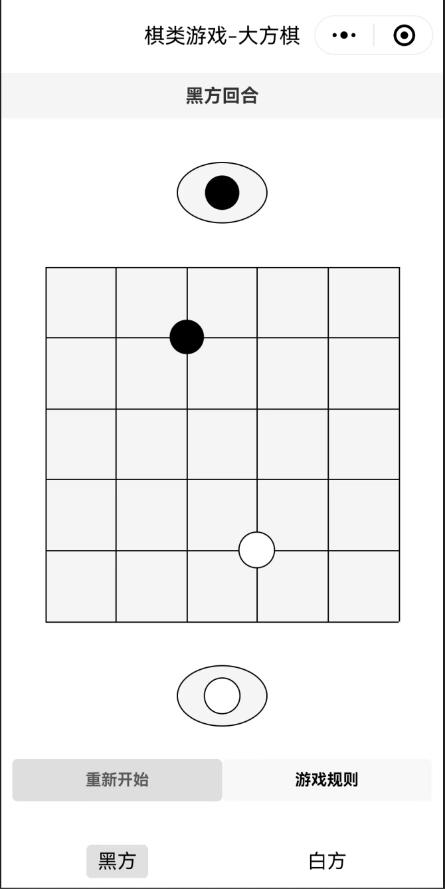

# 游戏名称：插大方

1、棋盘是一个6横线6竖线的方形，居中显示；上下各放一个棋盒，里面分别放一颗黑、白颜色的棋子；页面下方显示重新开始和游戏规则两个按钮，游戏规则的内容在本文最下方，点击“游戏规则”按钮后弹出详细规则；
2、棋子只能放在棋盘横线和竖线的交叉点处；玩家可以单击棋盘上的某个交叉点来落子；也可以在棋盘上通过拖动的方式来上下左右移动棋子，每次只能水平或垂直移动一格，且不能超出棋盘；还可以通过双击棋盘上的对方棋子来完成吃子；
3、形成特殊阵型时，对应阵型上的棋子会有黄色边框提醒；
4、游戏的胜负通过弹窗提醒。

## 游戏规则请参考rules.js

## 特性
本游戏支持真人手动下棋，也支持人机对战或者真人与AI对战，甚至两个AI自动下棋。
AI支持openai接口或者OLLama接口。

